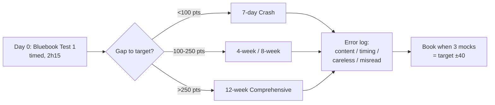

# SAT Study Tutor — Best Sources + How to Study

> The advanced, no-fluff system to go from ~1000 → 1450+ on the **Digital SAT**. Curated sources, proven study plans, and a complete AI + human tutor framework for Reading & Writing + Math. Updated for Bluebook + 2026 College Board format.

<p>
  <a href="https://github.com/Flynntaggart26/sat-study-tutor"></a>
  
  
  
  
  
  
  
</p>

**Stop grinding random PDFs.** This repo tells you in order:

1. **What to use** → 35+ sources tested, ranked by ROI, with free/paid + 1000/1300/1500 labels.
2. **How to study** → Diagnostic → 90-min loop → error log → weekly mock.
3. **Who corrects you** → Copy-paste AI prompts + human tutor scripts + checklists.

Bluebook for mocks only. Links only, no pirated QAS. Every task fits in ≤90 minutes.

---

## Table of Contents

- [Digital SAT Format in 60 Seconds](#-digital-sat-format-in-60-seconds)
- [Who Is This For?](#-who-is-this-for)
- [Start Here in 5 Minutes](#-start-here-in-5-minutes)
- [What You Get](#-what-you-get)
- [Top Sources TL;DR](#-top-sources-tldr)
- [Choose Your Study Path](#-choose-your-study-path)
- [The Study Method](#-the-study-method)
- [Quick Wins: +80 Pts in 7 Days](#-quick-wins-80-pts-in-7-days)
- [Repository Structure](#-repository-structure)
- [Skills at a Glance](#-skills-at-a-glance)
- [Desmos Starter](#-desmos-starter)
- [Tutor System](#-tutor-system)
- [Track Progress](#-track-progress)
- [Score Map](#-score-map)
- [FAQ](#-faq)
- [Contributing](#-contributing)
- [License](#-license)

---

## 📝 Digital SAT Format in 60 Seconds

| Section | Modules | Time | Questions | Notes |
|---------|---------|------|-----------|-------|
| **Reading & Writing** | Module 1: 32 min, Module 2: 32 min | 64 min | 54 (27+27) | Short passages 25-150 words, 1 Q each. Adaptive: M2 easy/hard depends on M1. |
| **Math** | Module 1: 35 min, Module 2: 35 min | 70 min | 44 (22+22) | Calculator + Desmos built-in all Math. Adaptive same way. |
| Break | — | 10 min | — | Between RW and Math. |

**Scoring:** RW 200-800 + Math 200-800 = 400-1600. No penalty for guessing — never leave blank. Superscore accepted by most colleges (best RW + best Math across dates).

**Where it lives:** Bluebook app (College Board). Bring fully charged laptop + charger + ID + admission ticket. Practice in Bluebook only for real timing.

Details + simulation protocol: [`sources/practice-tests.md`](sources/practice-tests.md).

---

## 🎯 Who Is This For?

| You are... | Your blocker is usually... | Start with |
|------------|---------------------------|------------|
| **900-1100, foundations shaky** | Algebra basics + sentence structure + timing | [`study-plans/12-week-comprehensive.md`](study-plans/12-week-comprehensive.md) |
| **1150-1300, stuck plateau** | Careless + hard-module misses + Desmos speed | [`study-plans/4-week-1200-to-1400.md`](study-plans/4-week-1200-to-1400.md) |
| **1350+, chasing 1500+** | 5-8 hard Qs + 2-3 careless | Bluebook 5-6 + [`skills/math-advanced.md`](skills/math-advanced.md) + error log only |
| **Busy (1-2h/day)** | Needs time-boxed plan | [`tutor/how-to-study-guide.md`](tutor/how-to-study-guide.md) + [`templates/weekly-planner.md`](templates/weekly-planner.md) |
| **Tutor / parent / club** | Needs lesson scripts | [`tutor/tutor-framework.md`](tutor/tutor-framework.md) |
| **7 days left** | Needs triage, not new content | [`study-plans/crash-7-days.md`](study-plans/crash-7-days.md) |

---

## 🚀 Start Here in 5 Minutes



1. **Diagnose (2h15):** Bluebook Practice Test 1, strict timing, morning. Score with [`study-plans/self-assessment.md`](study-plans/self-assessment.md). Log top 3 tags (e.g. punctuation, systems, transitions).
2. **Pick a plan:** [Choose Your Study Path](#-choose-your-study-path) — gap decides, not motivation.
3. **Install Top 5 only:** [`sources/best-sources.md`](sources/best-sources.md). Delete everything else until Week 3.
4. **Set up feedback:** Paste 1 prompt from [`tutor/ai-tutor-prompts.md`](tutor/ai-tutor-prompts.md) into ChatGPT/Claude. Test on 1 missed Q today.
5. **Track Day 0:** Copy [`templates/weekly-planner.md`](templates/weekly-planner.md), add row to [`templates/study-tracker.csv`](templates/study-tracker.csv).

> Rule: no new books in last 14 days. Only Bluebook + your error log.

---

## ✨ What You Get

### Part 1 — Best Sources for SAT (ranked, no fluff)

- **Tier 1 Official:** Bluebook 6 tests, Question Bank 2000+ Qs, Khan Academy Digital SAT — [`sources/best-sources.md`](sources/best-sources.md)
- **Books by score:** 1000 → 1300 → 1500 buying guide (buy 2, borrow rest) — [`sources/books-by-level.md`](sources/books-by-level.md)
- **Websites & apps:** Khan, 1600.io, UWorld, Desmos, r/SAT — what to click daily — [`sources/websites-apps.md`](sources/websites-apps.md)
- **YouTube:** 1600.io, Scalar Learning, Settele Tutoring — how to watch actively — [`sources/youtube-podcasts.md`](sources/youtube-podcasts.md)
- **Mocks:** adaptive simulation + scoring + save-newest protocol — [`sources/practice-tests.md`](sources/practice-tests.md)
- **Data:** [`data/sources.json`](data/sources.json) + [`data/formulas.json`](data/formulas.json) (machine-readable)

### Part 2 — How to Study + Tutor System

- **Core 90-min loop:** Warm-up → Input 1 concept → Timed set → Feedback <24h → Plan — [`tutor/how-to-study-guide.md`](tutor/how-to-study-guide.md)
- **4 plans:** 7-day crash, 4-week 1200→1400, 8-week 1050→1350, 12-week 900→1300+ with day-by-day tasks
- **6 skill guides:** RW ideas/craft, conventions/expression, algebra, advanced math, data, geometry/trig with Desmos checks
- **AI tutor:** 8 copy-paste prompts (math solve + Desmos, RW evidence, planner, vocab) — [`tutor/ai-tutor-prompts.md`](tutor/ai-tutor-prompts.md)
- **Human tutor:** diagnostic script + 60/90-min templates + homework policy — [`tutor/tutor-framework.md`](tutor/tutor-framework.md)
- **Templates:** weekly planner, CSV tracker, math/RW checklists, Desmos sheet, formula sheet — [`templates/`](templates/)

---

## 🏆 Top Sources TL;DR

| ★ | Source | Best For | Cost | Level |
|---|--------|----------|------|-------|
| ★★★★★ | Bluebook + 6 adaptive tests | Only real adaptive feel | Free | All |
| ★★★★★ | [Question Bank](https://satsuitequestionbank.collegeboard.org) | 2000+ Qs by tag/difficulty | Free | All |
| ★★★★★ | [Khan Academy Digital SAT](https://www.khanacademy.org/digital-sat) | Official adaptive path | Free | 900-1500 |
| ★★★★☆ | [1600.io](https://www.1600.io) | Video solutions to official tests | Free / paid | 1100+ |
| ★★★★☆ | College Panda Math + Erica Meltzer RW | 1300→1500 polish | Paid | 1200+ |
| ★★★★☆ | Desmos built-in + [desmos-sat-guide](https://github.com/Flynntaggart26/desmos-sat-guide) + UWorld | Calc speed + hard volume | Free / paid | 1200+ |

Free to 1400 path: Bluebook + QBank + Khan + 1600.io free. Paid adds speed to 1500+: 1 Math book + 1 RW book + UWorld 1 month.

Full 35+ with ratings + avoid-list: [`sources/best-sources.md`](sources/best-sources.md).

---

## 🗺️ Choose Your Study Path

| Plan | Time | h/day | Jump | File |
|------|------|-------|------|------|
| **7-Day Crash** | 1 week | 3h | Hold, fix timing/careless | [`study-plans/crash-7-days.md`](study-plans/crash-7-days.md) |
| **4-Week 1200→1400** | 4 weeks | 2-3h | +100-200 | [`study-plans/4-week-1200-to-1400.md`](study-plans/4-week-1200-to-1400.md) |
| **8-Week 1050→1350** | 8 weeks | 1.5-2h | +200-300 | [`study-plans/8-week-zero-to-hero.md`](study-plans/8-week-zero-to-hero.md) |
| **12-Week 900→1300+** | 12 weeks | 1-2h | +300-400 foundations | [`study-plans/12-week-comprehensive.md`](study-plans/12-week-comprehensive.md) |

**Schedules:**

| Days | 1h/day (minimum) | 2h/day (recommended) | 4h/day (summer) |
|------|------------------|----------------------|-----------------|
| Mon | 1 RW set (32 min) + log | RW set + conventions drill | AM RW + PM vocab review |
| Tue | 1 Math set (35 min) + log | Math set + Desmos 10 min | AM Math + PM redo misses |
| Wed | Review misses only | RW + Math mixed 22 Q | Full RW section timed |
| Thu | Opposite section set | Weak-tag deep dive | Full Math section timed |
| Fri | Mixed 15 Q | Mixed mini-module | Mixed + AI review |
| Sat | Bluebook section biweekly | Mock section weekly + review | Full mock + review Sun |
| Sun | Off | Light Khan / rest | Review + plan |

Full day-by-day in each `study-plans/` file.

---

## 🧠 The Study Method

```
Diagnose → Input 1 concept (20m) → Timed set 15-22Q (45m) → Feedback <24h (15m) → Spaced redo (10m) → Mock weekly
```

| Principle | What to do | Why |
|-----------|------------|-----|
| **80/20** | Conventions + Heart of Algebra first | Cheapest points to 1350 |
| **Error taxonomy** | Tag every miss: content / timing / careless / misread | Fixes pattern, not symptom |
| **Timed from Week 2** | RW 1.1 min/Q, Math 1.6 min/Q, guess + flag >2 min | Adaptive punishes slow |
| **One tag/week** | 7 days punctuation > 7 topics in 1 day | Retention |
| **Desmos daily** | Graph > algebra for 30% Math | Speed to hard module |

Session script + 1h/2h/4h rhythms + readiness checklist: [`tutor/how-to-study-guide.md`](tutor/how-to-study-guide.md).
Caps list to check before every mock: [`tutor/common-mistakes.md`](tutor/common-mistakes.md).

---

## ⚡ Quick Wins: +80 Pts in 7 Days

Most 1100-1300 students leak the same points. Fix in order:

- [ ] **Day 1-2:** Comma splices + apostrophes (5 RW Qs). Do Meltzer Ch 1-2 + 22 QBank easy/medium.
- [ ] **Day 3:** Linear systems via Desmos intersection (4 Math Qs). Graph, don't substitute.
- [ ] **Day 4:** Transitions (however/thus/for example) — read sentence before + after blank.
- [ ] **Day 5:** Percent/ratio misreads — underline “of / increase / given”.
- [ ] **Day 6:** Never blank + guess + flag. 2-3 extra raw points free.
- [ ] **Day 7:** Full Bluebook section timed, review only error-log tags.

Checklists: [`templates/rw-checklist.md`](templates/rw-checklist.md), [`templates/math-checklist.md`](templates/math-checklist.md).

---

## 🗂️ Repository Structure

```text
sat-study-tutor/
├── sources/
│   ├── best-sources.md       # master ranked list
│   ├── books-by-level.md     # 1000→1500 buying guide
│   ├── websites-apps.md      # Khan / QBank / 1600.io / UWorld / Desmos
│   ├── youtube-podcasts.md   # active-watching protocol
│   └── practice-tests.md     # Bluebook simulation + scoring
├── skills/
│   ├── reading-writing.md          # info/ideas + craft/structure
│   ├── conventions-expression.md   # punctuation → verbs → transitions
│   ├── math-algebra.md             # linear, systems, functions
│   ├── math-advanced.md            # quadratics, exponents, equivalents
│   ├── math-problem-solving.md     # ratios, %, stats
│   └── geometry-trig.md            # triangles, circles, SOHCAHTOA
├── study-plans/
│   ├── self-assessment.md
│   ├── crash-7-days.md
│   ├── 4-week-1200-to-1400.md
│   ├── 8-week-zero-to-hero.md
│   └── 12-week-comprehensive.md
├── tutor/
│   ├── how-to-study-guide.md
│   ├── ai-tutor-prompts.md         # 8 copy-paste prompts
│   ├── tutor-framework.md
│   ├── feedback-templates.md
│   └── common-mistakes.md
├── templates/
│   ├── weekly-planner.md
│   ├── study-tracker.csv
│   ├── math-checklist.md
│   ├── rw-checklist.md
│   ├── desmos-cheatsheet.md       # 15 must-know inputs
│   └── formula-sheet.md           # memorize vs given
├── data/
│   ├── sources.json
│   └── formulas.json
├── .github/
├── CONTRIBUTING.md
└── LICENSE
```

---

## 📚 Skills at a Glance

| Skill | % of section | Win habit | Guide |
|-------|--------------|-----------|-------|
| RW Info & Ideas + Craft | ~60% RW | Predict before choices, quote evidence | [`skills/reading-writing.md`](skills/reading-writing.md) |
| Conventions + Expression | ~40% RW | Punctuation → verbs → transitions, shortest correct wins | [`skills/conventions-expression.md`](skills/conventions-expression.md) |
| Algebra (linear/systems) | ~35% Math | Write equation, Desmos check | [`skills/math-algebra.md`](skills/math-algebra.md) |
| Advanced Math | ~35% Math | Factor / vertex / plug x=2 to test choices | [`skills/math-advanced.md`](skills/math-advanced.md) |
| Problem Solving / Data | ~15% Math | Units every step, estimate first | [`skills/math-problem-solving.md`](skills/math-problem-solving.md) |
| Geometry / Trig | ~15% Math | Draw + label, triples + circle eq | [`skills/geometry-trig.md`](skills/geometry-trig.md) |

---

## 📐 Desmos Starter

> Dedicated companion repo: **[desmos-sat-guide](https://github.com/Flynntaggart26/desmos-sat-guide)** — 30 copy-paste inputs, 10 worked examples, 15 speed drills, printable 1-page cheatsheet.
> 🌐 **Live interactive webpage (real Desmos inside): https://flynntaggart26.github.io/desmos-sat-guide/** — calculator + Desmos-friendly question types + tricks + full 6Q exercise.

Built into Bluebook Math. Learn these 5 first (full 15 in [`templates/desmos-cheatsheet.md`](templates/desmos-cheatsheet.md), full 30 in [desmos-sat-guide](https://github.com/Flynntaggart26/desmos-sat-guide)):

1. `y=mx+b` — slide `m`/`b` to see slope/intercept.
2. Intersection: graph both lines → click point → solution to system.
3. `y=ax^2+bx+c` — roots = x-intercepts, vertex = max/min.
4. Table: `+` → table → plug x values to test choices.
5. `mean()`, `median()` quick check for stats Qs.

10 min/day in Desmos test mode. If algebra takes >90 sec, graph it.

---

## 🤝 Tutor System

**Self + AI daily (15 min feedback):**
```text
Timed set → mark → paste Q + your work into AI prompt (tutor/ai-tutor-prompts.md)
→ get concept + Desmos way + 2 similar Qs → redo by hand → log tag
```

**Human 1-2x/week:** diagnostic + 60-min Math / 60-min RW / 90-min mock-review in [`tutor/tutor-framework.md`](tutor/tutor-framework.md). Max 3 patterns/session. Homework: 3 sets + redo misses. No redo = no new set.

Fastest per cost: AI daily + human weekly.

---

## 📊 Track Progress

- **Daily** in [`templates/study-tracker.csv`](templates/study-tracker.csv): `date, section, task, score, error_type, fix`.
- **Weekly** in [`templates/weekly-planner.md`](templates/weekly-planner.md): top 3 tags, next-week adjustment.
- **Pre-submit:** [`templates/math-checklist.md`](templates/math-checklist.md), [`templates/rw-checklist.md`](templates/rw-checklist.md).
- **Milestones:** W2 sets 80% medium, W4 first hard module, W6 ≤5 careless/mock, W8 3 mocks ±40 target.

No +80 in 6 weeks at 8h/week → you need feedback frequency, not more hours.

---

## 📈 Score Map

| Total | RW / Math | Misses approx. | Meaning |
|-------|-----------|----------------|---------|
| 1000 | ~500 / ~500 | ~20/section | Foundations + timing gaps |
| 1200 | ~600 / ~600 | ~12-14/section | Medium modules solid |
| 1350 | ~670 / ~680 | ~7-9/section | Hard module, 5-8 hard + 2-3 careless |
| 1500+ | ~740+ / ~760+ | ≤5 total | Clean conventions/algebra + Desmos speed |

> ~120-180 focused hours per +150 pts with feedback. 8 weeks at 2h/day ≈ +200 realistic from 1150.

---

## 🙋 FAQ

**Digital adaptive — how does it work?** M1 decides M2 difficulty. Strong M1 → hard M2 (needed for 700+). One early careless can cap you — warm up, go slow first 10 Qs.

**Calculator policy?** Desmos + personal calculator allowed all Math. Learn Desmos — faster than hand for systems/quadratics.

**Free to 1400?** Yes: Bluebook + QBank + Khan + 1600.io free covers it. Buy Panda + Meltzer only for 1450+ speed.

**Superscore?** Most colleges take best RW + best Math across dates. Check target schools — plan 2 sittings if needed.

**How many times?** 2-3 max with prep between. No improvement without error-log change.

**When to book?** 3 timed Bluebook mocks within ±40 of target, conventions + algebra tags clean.

**How many mocks?** 1/2 weeks early → 1/week last month → 2/week last 2 weeks. Save Bluebook 5-6 newest for final 10 days.

**Paper books still ok?** Pre-2024 paper books are wrong for RW. Use Digital-labeled 2024+ only.

---

## 🤲 Contributing

See [`CONTRIBUTING.md`](CONTRIBUTING.md). New source needs: name, URL, cost, level (1000/1300/1500), why it beats Tier equivalent. No pirated QAS — links only. Small PRs merge fastest.

---

## 📄 License

MIT — see [LICENSE](LICENSE). College Board / Khan / Bluebook content belongs to owners. Original guides + links only.

---

⭐ If this helped, **star the repo** and share starting → target → achieved in Discussions. It helps others pick plans.
