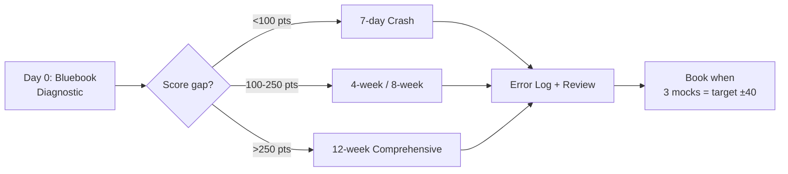

# SAT Study Tutor — Best Sources + How to Study

> The advanced, no-fluff system to go from ~1000 → 1450+ on the Digital SAT. Curated sources, proven study plans, and a complete AI + human tutor framework for Reading & Writing + Math.

<p>
  <a href="https://github.com/Flynntaggart26/sat-study-tutor"></a>
  
  
  
  
  
  
</p>

**Stop grinding random PDFs.** This repo answers 3 questions in order:

1. **What should I use?** → 35+ sources tested, ranked, free/paid + score-level labels.
2. **How should I study?** → Diagnostic → plan → deliberate practice → feedback loop.
3. **Who corrects me?** → Copy-paste AI prompts + human tutor lesson plans + checklists.

Official College Board Bluebook only for mocks. Links only, no pirated tests. Everything fits in ≤90-minute sessions.

---

## Table of Contents

- [Who Is This For?](#-who-is-this-for)
- [Start Here in 5 Minutes](#-start-here-in-5-minutes)
- [What You Get](#-what-you-get)
- [Top Sources TL;DR](#-top-sources-tldr)
- [Choose Your Study Path](#-choose-your-study-path)
- [The Study Method](#-the-study-method)
- [Repository Structure](#-repository-structure)
- [Skills at a Glance](#-skills-at-a-glance)
- [Tutor System](#-tutor-system)
- [Track Progress](#-track-progress)
- [Score Map](#-score-map)
- [FAQ](#-faq)
- [Contributing](#-contributing)
- [License](#-license)

---

## 🎯 Who Is This For?

| You are... | Use this repo to... | Start with |
|------------|---------------------|------------|
| **PSAT / 900-1100, need foundations** | Build algebra + grammar + vocab base | `study-plans/12-week-comprehensive.md` |
| **Stuck 1150-1300, need 1400+** | Fix careless errors + timing + hard modules | `study-plans/4-week-1200-to-1400.md` |
| **Busy student (1-2h/day)** | Follow time-boxed system | `tutor/how-to-study-guide.md` + `templates/weekly-planner.md` |
| **Tutor / study partner** | Run 60/90-min lessons | `tutor/tutor-framework.md` |
| **1 week to test** | Maximize current level | `study-plans/crash-7-days.md` |

Digital SAT = 2x Reading & Writing modules (32 min + 32 min) + 2x Math modules (35 min + 35 min), adaptive. Calculator allowed throughout Math.

---

## 🚀 Start Here in 5 Minutes



1. **Diagnose (2h):** Take Bluebook Practice Test 1 timed. Score with [`study-plans/self-assessment.md`](study-plans/self-assessment.md).
2. **Pick a plan:** See [Choose Your Study Path](#-choose-your-study-path).
3. **Install only Top 5:** Open [`sources/best-sources.md`](sources/best-sources.md). Ignore the rest until Week 3.
4. **Set up feedback:** Copy 1 prompt from [`tutor/ai-tutor-prompts.md`](tutor/ai-tutor-prompts.md).
5. **Track:** Duplicate [`templates/weekly-planner.md`](templates/weekly-planner.md) + log Day 0 in [`templates/study-tracker.csv`](templates/study-tracker.csv).

> Rule: Bluebook mocks only in last 14 days. No new books then.

---

## ✨ What You Get

### Part 1 — Best Sources for SAT

- **Tier 1 Official:** Bluebook (6 adaptive tests), College Board Question Bank, Khan Academy Digital SAT — ranked
- **Books by level:** 1000 → 1300 → 1500 roadmap (College Panda, Erica Meltzer, etc.) — [`sources/books-by-level.md`](sources/books-by-level.md)
- **Websites & apps:** how to use each (Khan, 1600.io, UWorld, Desmos) — [`sources/websites-apps.md`](sources/websites-apps.md)
- **YouTube & podcasts:** Scalar Learning, 1600.io, Settele Tutoring — [`sources/youtube-podcasts.md`](sources/youtube-podcasts.md)
- **Practice tests:** Bluebook + where to simulate adaptive timing — [`sources/practice-tests.md`](sources/practice-tests.md)
- **Machine-readable:** [`data/sources.json`](data/sources.json)

### Part 2 — How to Study + Tutor System

- **Core method:** 90-min Diagnose → Input → Timed Practice → Feedback — [`tutor/how-to-study-guide.md`](tutor/how-to-study-guide.md)
- **4 ready plans:** 7-day crash, 4-week (1200→1400), 8-week (1050→1350), 12-week (900→1300+)
- **6 skill guides:** RW craft/structure, info/ideas, conventions, expression + Math algebra/advanced/problem-solving/geometry
- **AI tutor:** 6 prompts for math solutions, RW explanations, essay-free SAT review — [`tutor/ai-tutor-prompts.md`](tutor/ai-tutor-prompts.md)
- **Human tutor:** diagnostic script, lesson templates — [`tutor/tutor-framework.md`](tutor/tutor-framework.md)
- **Templates:** checklists, tracker — [`templates/`](templates/)

---

## 🏆 Top Sources TL;DR

| ★ | Source | Best For | Cost |
|---|--------|----------|------|
| ★★★★★ | Bluebook + College Board Question Bank | Real adaptive mocks, gold standard | Free |
| ★★★★★ | [Khan Academy Digital SAT](https://www.khanacademy.org/digital-sat) | Official adaptive practice | Free |
| ★★★★☆ | [1600.io](https://www.1600.io) | Free video solutions to official tests | Free / paid |
| ★★★★☆ | College Panda SAT Math + Erica Meltzer RW | Best books for 1300→1500 | Paid |
| ★★★★☆ | Desmos (built-in) + UWorld | Calculator mastery + volume drills | Free / paid |

Full 35+ list: [`sources/best-sources.md`](sources/best-sources.md).

---

## 🗺️ Choose Your Study Path

| Plan | Time | Hours/day | Target jump | File |
|------|------|-----------|-------------|------|
| **7-Day Crash** | 1 week | 3h | Hold score, fix timing | [`study-plans/crash-7-days.md`](study-plans/crash-7-days.md) |
| **4-Week 1200→1400** | 4 weeks | 2-3h | +100-200 pts | [`study-plans/4-week-1200-to-1400.md`](study-plans/4-week-1200-to-1400.md) |
| **8-Week 1050→1350** | 8 weeks | 1.5-2h | +200-300 pts structured | [`study-plans/8-week-zero-to-hero.md`](study-plans/8-week-zero-to-hero.md) |
| **12-Week Comprehensive** | 12 weeks | 1-2h | 900→1300+ foundations | [`study-plans/12-week-comprehensive.md`](study-plans/12-week-comprehensive.md) |

Example week (10-12h):

| Day | 90 min focus |
|-----|--------------|
| Mon | RW conventions + vocab |
| Tue | Math Algebra timed set |
| Wed | RW info/ideas + review |
| Thu | Math Advanced + Desmos |
| Fri | Mixed timed mini-module |
| Sat | Bluebook section + error log |
| Sun | Rest or light Khan review |

---

## 🧠 The Study Method

```
Diagnose → Focused Input (20m) → Timed Set (45m) → Feedback <24h (15m) → Spaced Review (10m) → Mock weekly
```

1. **80/20:** Standard English Conventions + Heart of Algebra = cheapest points. Fix there first.
2. **Error log > hours:** every miss logged as content / timing / careless / misread.
3. **Timed from Week 2:** Digital SAT punishes slow. 1.1 min/RW Q, 1.6 min/Math Q.
4. **One weakness at a time:** 7 days of linear equations beats 7 topics in 1 day.
5. **Desmos fluency:** 30% of Math is faster graphed. Practice daily.

Details: [`tutor/how-to-study-guide.md`](tutor/how-to-study-guide.md). Caps: [`tutor/common-mistakes.md`](tutor/common-mistakes.md).

---

## 🗂️ Repository Structure

```text
sat-study-tutor/
├── sources/
│   ├── best-sources.md
│   ├── books-by-level.md
│   ├── websites-apps.md
│   ├── youtube-podcasts.md
│   └── practice-tests.md
├── skills/
│   ├── reading-writing.md
│   ├── conventions-expression.md
│   ├── math-algebra.md
│   ├── math-advanced.md
│   ├── math-problem-solving.md
│   └── geometry-trig.md
├── study-plans/
│   ├── self-assessment.md
│   ├── crash-7-days.md
│   ├── 4-week-1200-to-1400.md
│   ├── 8-week-zero-to-hero.md
│   └── 12-week-comprehensive.md
├── tutor/
│   ├── how-to-study-guide.md
│   ├── ai-tutor-prompts.md
│   ├── tutor-framework.md
│   ├── feedback-templates.md
│   └── common-mistakes.md
├── templates/
│   ├── weekly-planner.md
│   ├── study-tracker.csv
│   ├── math-checklist.md
│   └── rw-checklist.md
├── data/sources.json
├── CONTRIBUTING.md
└── LICENSE
```

---

## 📚 Skills at a Glance

| Skill | Weight | Habit | Guide |
|-------|--------|-------|-------|
| RW Info & Ideas + Craft | ~60% RW | Evidence first, predict before choices | [`skills/reading-writing.md`](skills/reading-writing.md) |
| Conventions + Expression | ~40% RW | Punctuation → verbs → transitions drill | [`skills/conventions-expression.md`](skills/conventions-expression.md) |
| Algebra (linear) | ~35% Math | Solve + Desmos check every Q | [`skills/math-algebra.md`](skills/math-algebra.md) |
| Advanced Math | ~35% Math | Quadratics, functions, equivalents | [`skills/math-advanced.md`](skills/math-advanced.md) |
| Problem Solving / Data | ~15% Math | Ratios, % , stats, no over-calc | [`skills/math-problem-solving.md`](skills/math-problem-solving.md) |
| Geometry / Trig | ~15% Math | Draw, plug, special triangles | [`skills/geometry-trig.md`](skills/geometry-trig.md) |

---

## 🤝 Tutor System

**Self + AI daily:**
```text
Timed set → mark → paste missed Q + your work into AI prompt →
get concept + 2 similar Qs → redo by hand → log
```

**Human 1-2x/week:** diagnostic + 60-min Math / 60-min RW / 90-min mock-review templates in [`tutor/tutor-framework.md`](tutor/tutor-framework.md). Max 3 patterns/session.

---

## 📊 Track Progress

- Daily in [`templates/study-tracker.csv`](templates/study-tracker.csv): `date, section, source, score, error_type, fix`.
- Weekly in [`templates/weekly-planner.md`](templates/weekly-planner.md): top 3 patterns, adjust.
- Checklists: [`templates/math-checklist.md`](templates/math-checklist.md), [`templates/rw-checklist.md`](templates/rw-checklist.md).

Re-test every 2 weeks, Bluebook timed. No +80 pts in 6 weeks at 8h/week → need feedback, not hours.

---

## 📈 Score Map

| Total | RW | Math | What it means |
|-------|----|------|---------------|
| 1000 | ~500 | ~500 | Foundations gaps, untimed errors |
| 1200 | ~600 | ~600 | Medium modules, timing ok, hard misses |
| 1350 | ~670 | ~680 | Hard module reached, careless + 5-8 hard Qs |
| 1500+ | ~740+ | ~760+ | ≤5 misses total, Desmos + grammar clean |

> ~120-180 focused hours per +150 pts with feedback.

---

## 🙋 FAQ

**Digital vs paper?** Only Digital now (US since 2024). Adaptive: Module 2 difficulty depends on Module 1. Practice in Bluebook only for real feel.

**Calculator?** Allowed all Math. Learn Desmos graphing/systems — faster than algebra for 30% of Qs.

**Free to 1400?** Yes: Bluebook + Question Bank + Khan + 1600.io is enough. Books help for 1450+ polish.

**When to book?** 3 timed Bluebook mocks within ±40 of target, error log clean on conventions + algebra.

**How many mocks?** 1 per 2 weeks early, 1/week last month, 2/week last 2 weeks. 6 Bluebook tests — save 2 newest for final.

---

## 🤲 Contributing

See [`CONTRIBUTING.md`](CONTRIBUTING.md). New source needs: name, URL, cost, level, why it beats Tier equivalent. No pirated QAS PDFs — links only.

---

## 📄 License

MIT — see [LICENSE](LICENSE). College Board content belongs to College Board. This repo curates links + original guides.

---

⭐ If this helped, **star the repo** and share starting → target → achieved score in Discussions.
